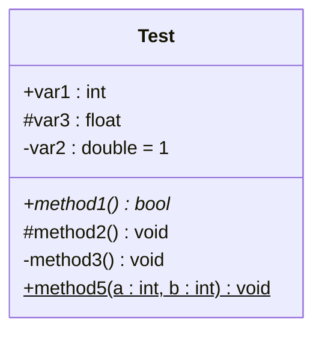
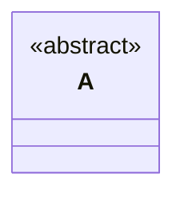
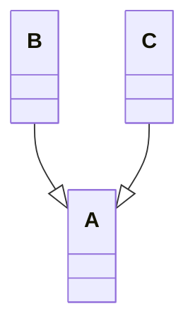
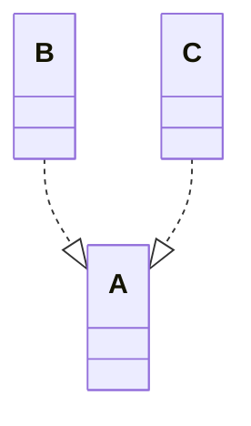
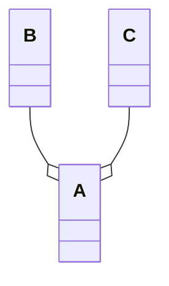
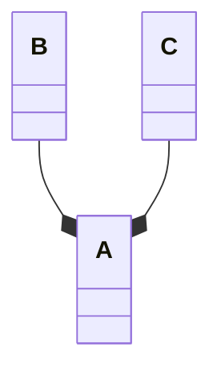
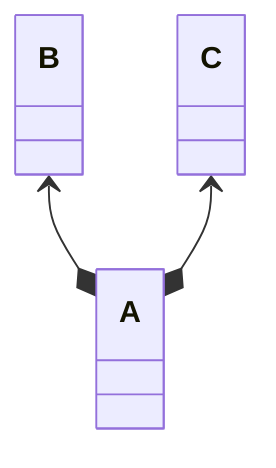
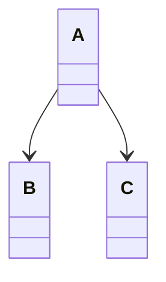
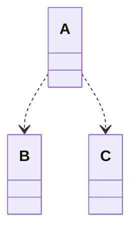

### 类图

类图由类和类之间的关系组成，对类的定义由三个部分组成：类名、类的属性、类的方法。

类名：图中 Test 为类名，如果字体为斜体，或指明 <\<abstarct\>> 则表示抽象类

类的属性：类名下方区域

符号解释：

- +：public，共有的
- #：protected，保护的
- -：private，私有的
- =：默认值
- 下划线：静态成员
- 斜体：抽象
- 冒号前是方法/属性（根据有无括号区分），冒号后是返回参数/属性类型，如果没有冒号则表示方法返回空（也可以使用 : void）

类的方法：类的属性下方区域

### 继承关系

B 和 C 继承自 A

也称泛化关系，子类继承父类所有方法和属性，子类可以新增方法和重写父类方法。

两个对象可以使用 is-a 表示。

### 实现关系

B 和 C 实现自 A

类与接口的关系。

### 聚合关系

B 和 C 聚合成 A

表示实体对象之间的关系，弱拥有，表示整体由部分构成的语义，例如一个部门由多个员工组成，即使（部门）整体不存在，但（员工）部分依然存在。

### 组合关系

B 和 C 组合成 A

表示实体对象之间的关系，表示整体由部分组成的语义，例如一个公司由多个部门组成，如果（公司）整体不存在，则（部门）部分也不存在。

### 关联关系

A 关联于 B 和 C

关联关系是两个类之间的引用关系。

关联关系是较长的周期内相互协作，关联关系可以是单向或双向：

单向关联：一个类知道另一个类，有一个指向另一个类的引用

双向关联：两个类相互知道对方，各有一个指向对方的引用

关联关系通常在类的属性中体现，即一个类的对象作为另个类的成员变量

### 依赖关系

A 依赖于 B 和 C

依赖关系是一种使用关系，一个类的实现依赖另一个类的定义。

依赖关系是临时的，比如一个类的方法调用另一个类的方法。

依赖关系表现为局部变量、方法的参数或者静态方法的调用。

### FAQ

> **聚合关系与组合关系如何区分**？
> 
> 聚合关系：
> - 松散的“整体-部分”关系，部分对象可以独立存在
> - 部分对象的生命周期可以独立于整体对象而存在
> - 强调的是对象之间的合作
>
> 组合关系：
> - 严格的“整体-部分”关系，部分无法独立存在
> - 整体对象创建时，部分对象也会同时创建；整体对象销毁时，部分对象也会销毁