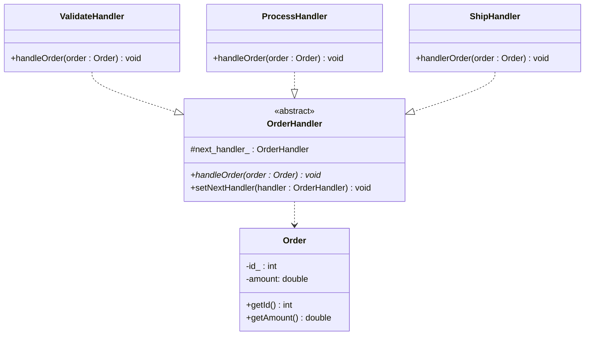

### 责任链模式

适用场景：
- 请求需要按照顺序经过多个处理步骤
- 不确定请求的接受者
- 需要动态的指定责任链中的处理器
- 避免请求发送者与接受者之间的紧密耦合关系

优点：
- 可拓展性：责任链模式允许动态地向链中添加、修改或移除处理器
- 解耦发送者和接受者：发送者不需要知道请求的接受者，接受者也不需要知道请求的发送者
- 单一职责原则：责任链模式将请求的处理拆分成多个处理步骤，每个处理器只需要关注自己的处理逻辑

缺点：
- 请求可能无法被处理：请求的末端可能无法被处理，如果没有设置合适的默认处理器，请求可能会被“吞掉”
- 性能问题：每个请求必须沿着链进行传递，当链中处理器较多时，可能会导致性能问题
- 调试困难：当链中处理器较多时，定位问题较困难

### UML

