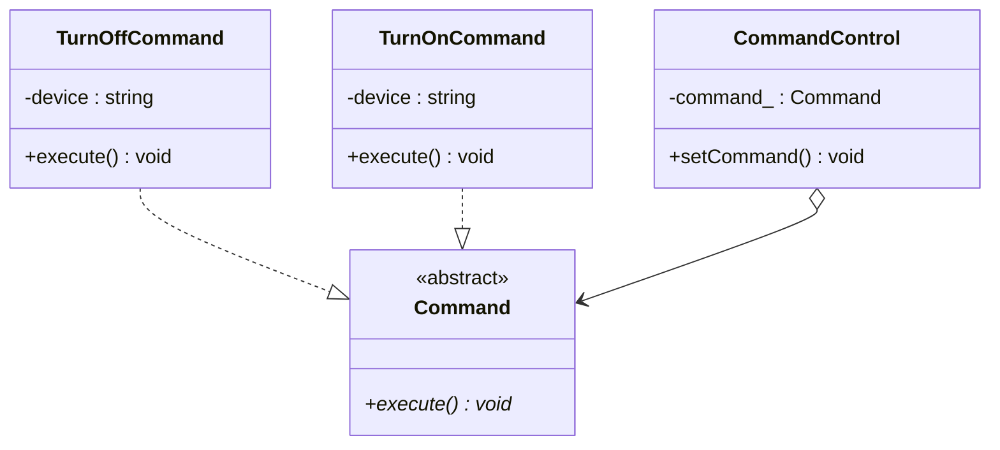

### 命令模式

别称动作（Action）、事务（Transaction）

适用场景：
- 请求的发送者和接受者需要解耦
- 需要将请求参数化
- 需要支持撤销和恢复操作
- 需要支持命令队列

优点：
- 解耦发送者和接受者
- 可拓展性
- 支持撤销和恢复操作
- 支持命令队列

缺点：
- 类的数量增加：每个命令都需要一个具体的命令类

### UML

```mermaid
classDiagram

class Command {
    <<abstract>>
    +execute() void *
}

class TurnOffCommand {
    -device : string
    +execute() void
}

class TurnOnCommand {
    -device : string
    +execute() void
}

TurnOffCommand ..|> Command
TurnOnCommand ..|> Command

class CommandControl {
    -command_ : Command
    +setCommand() void

}

CommandControl o--> Command
```