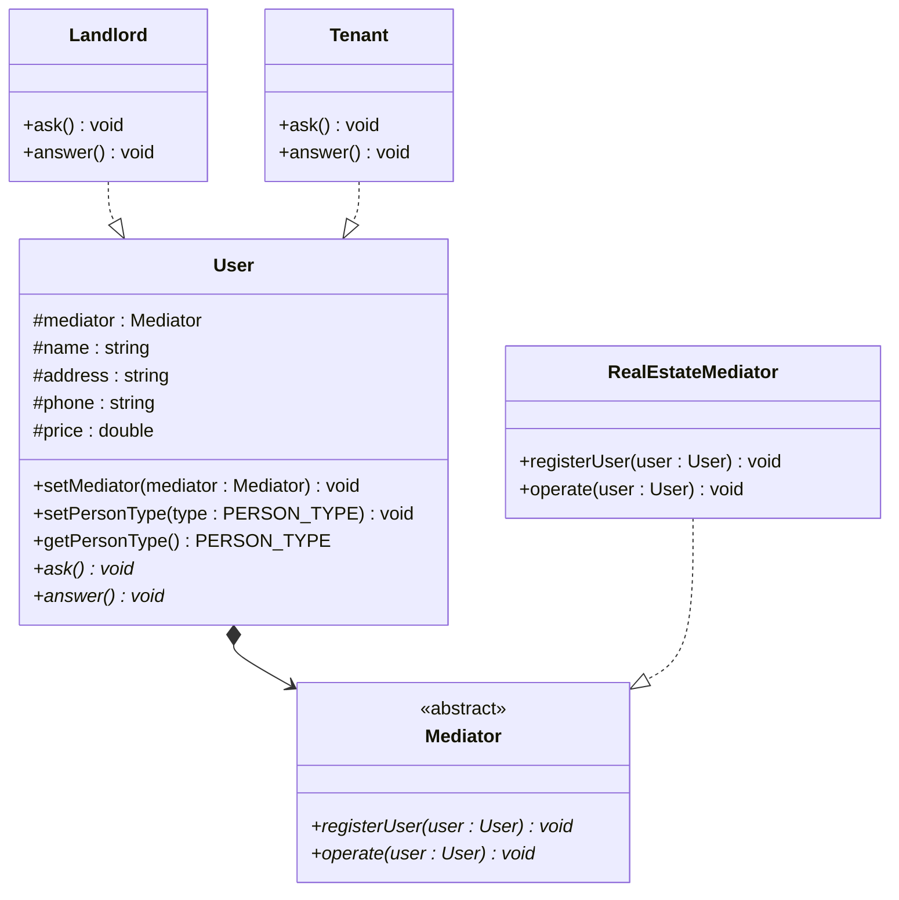

### 中介者模式

### UML

```mermaid
classDiagram

class User {
    #mediator : Mediator
    #name : string
    #address : string
    #phone : string
    #price : double
    +setMediator(mediator : Mediator) void
    +setPersonType(type : PERSON_TYPE) void
    +getPersonType() PERSON_TYPE
    +ask() void *
    +answer() void *
}

class Landlord {
    +ask() void
    +answer() void
}

class Tenant {
    +ask() void
    +answer() void
}

class Mediator {
    <<abstract>>
    +registerUser(user : User) void *
    +operate(user : User) void *
}

class RealEstateMediator {
    +registerUser(user : User) void
    +operate(user : User) void
}

Landlord ..|> User
Tenant ..|> User
User *--> Mediator
RealEstateMediator ..|> Mediator
```