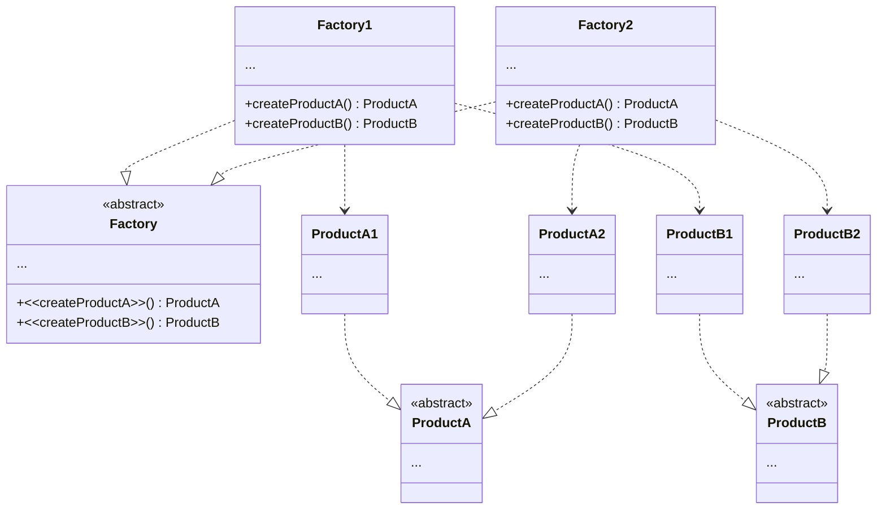

### 抽象工厂模式

#### UML

#### 优点

- 确保同一工厂生产的产品相互匹配
- 可以避免客户端和具体代码的耦合
- 符合单一职责原则，产品生成代码位于同一位置
- 符合开闭原则，程序引入新产品时无需修改客户端代码

#### 缺点

- 复杂性增加，抽象工厂引入的多个新的接口和类，增加了系统的复杂性
- 难以增加新种类的产品，如需增加新的产品种类，则可能需要修改抽象工厂的接口，这导致所有实现这个接口的具体工厂都要修改