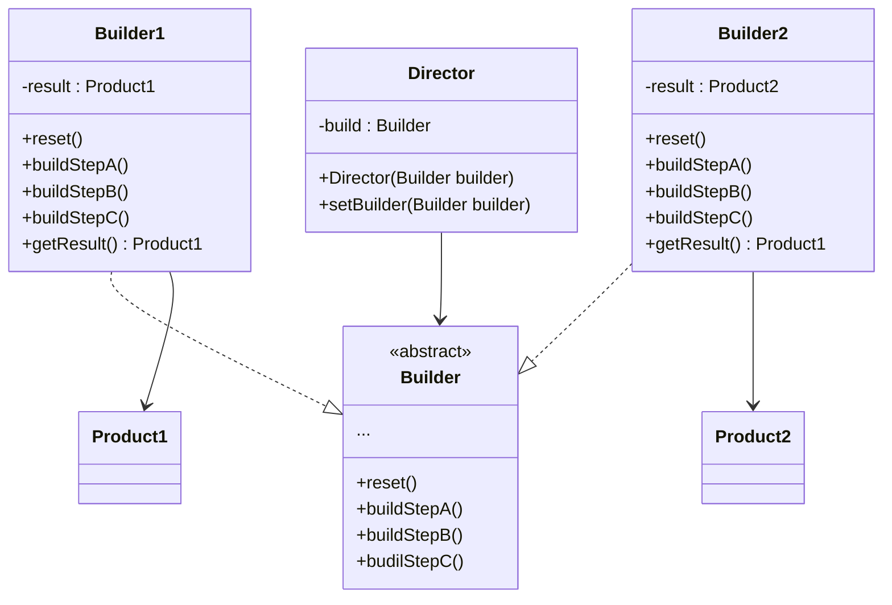

### 构建者模式

#### UML

```mermaid
classDiagram

class Product1

class Product2

class Builder {
    <<abstract>>
    ...
    +reset()
    +buildStepA()
    +buildStepB()
    +budilStepC()
}

class Builder1 {
    -result : Product1

    +reset()
    +buildStepA()
    +buildStepB()
    +buildStepC()
    +getResult() Product1
}

class Builder2 {
    -result : Product2

    +reset()
    +buildStepA()
    +buildStepB()
    +buildStepC()
    +getResult() Product1
}

Builder1 ..|> Builder
Builder2 ..|> Builder

Builder1 --> Product1
Builder2 --> Product2

class Director {
    -build : Builder

    +Director(Builder builder)
    +setBuilder(Builder builder)
}

Director --> Builder
```

#### 优点

- 可以分步创建对象，暂缓创建步骤或递归运行创建步骤
- 生成不同形式的产品，可以复用相同的制造代码
- 符合单一职责原则

#### 缺点

- 生成器模式需要多个类，因此代码复杂度增加