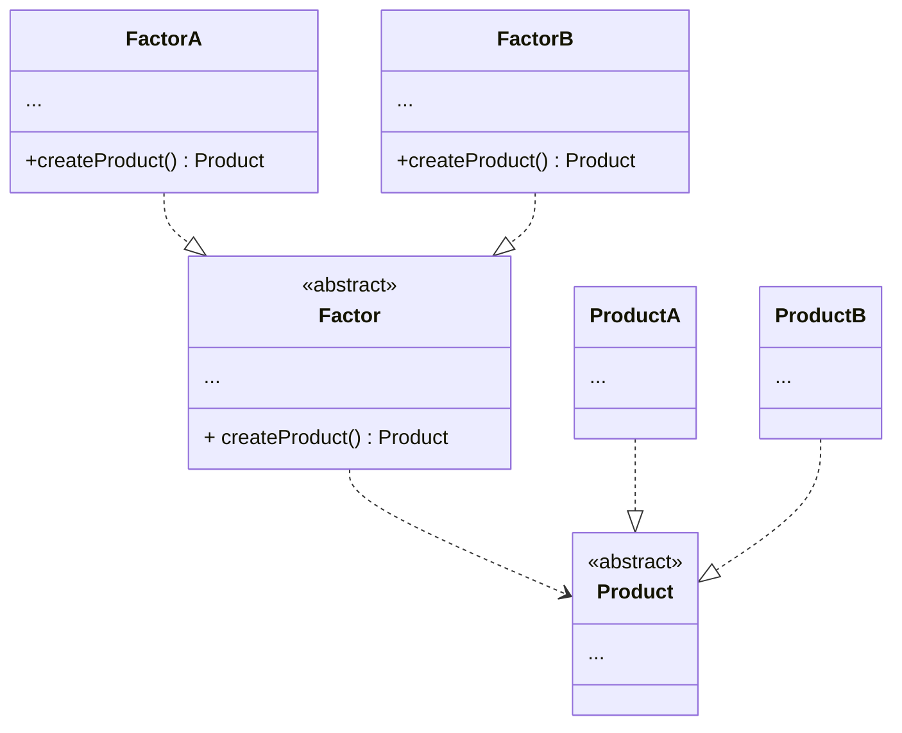

### 工厂模式

#### UML

#### 优点

- 降低耦合度，工厂方法通过定义一个创建对象的接口来降低客户端代码与具体类之间的耦合度
- 提高代码的可维护性，由于创建实例的代码被封装在工厂类中，当需要修改、拓展或替换对象的创建逻辑时，只需要修改工厂类
- 提高代码的可拓展性，如引入新的产品类，只需要创建一个相应的工厂类即可
- 符合开闭原则，工厂模式允许在不修改现有代码的情况下引入新的产品类

#### 缺点

- 可能导致类的数量增加，每添加一个新的产品，通常都要增加一个相应的具体工厂类