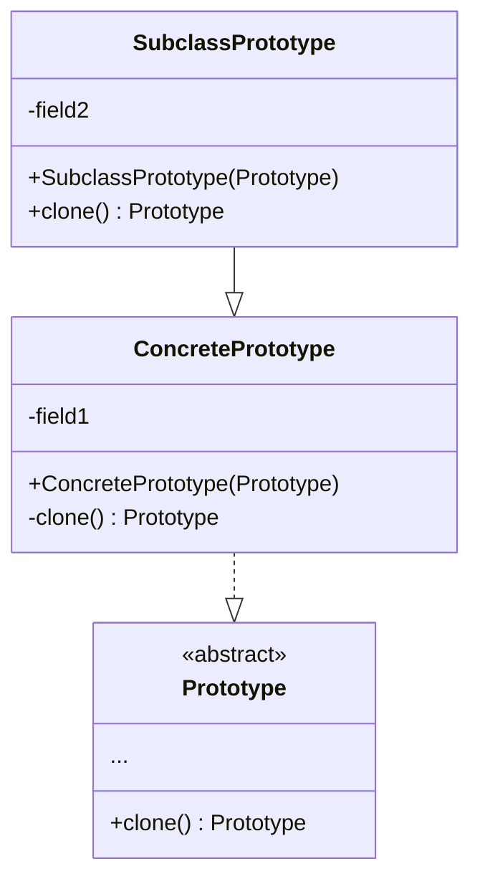

### 原型模式

别名克隆（clone）

#### UML

```mermaid
classDiagram

class Prototype {
    <<abstract>>
    ...
    +clone() Prototype
}

class ConcretePrototype {
    -field1

    +ConcretePrototype(Prototype)
    -clone() Prototype
}

class SubclassPrototype {
    -field2

    +SubclassPrototype(Prototype)
    +clone() Prototype
}

ConcretePrototype ..|> Prototype

SubclassPrototype --|> ConcretePrototype
```