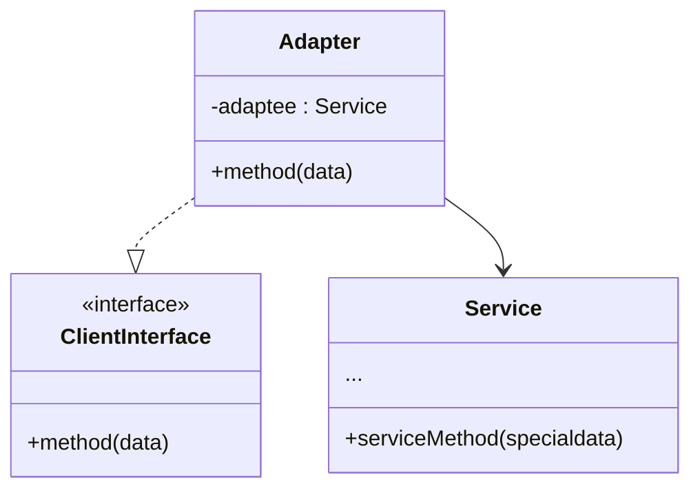
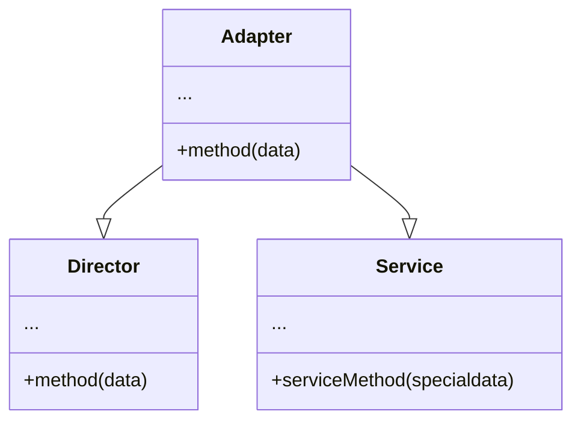

### adapter

别名封装器模式（Wrapper）

#### 对象适配器

##### UML

```mermaid
classDiagram

class ClientInterface {
    <<interface>>
    +method(data)
}

class Adapter {
    -adaptee : Service

    +method(data)
}

class Service {
    ...
    +serviceMethod(specialdata)
}

Adapter ..|> ClientInterface
Adapter --> Service
```

#### 类适配器

##### UML

```mermaid
classDiagram

class Director {
    ...
    +method(data)
}

class Service {
    ...
    +serviceMethod(specialdata)
}

class Adapter {
    ...
    +method(data)
}

Adapter --|> Director
Adapter --|> Service 
```