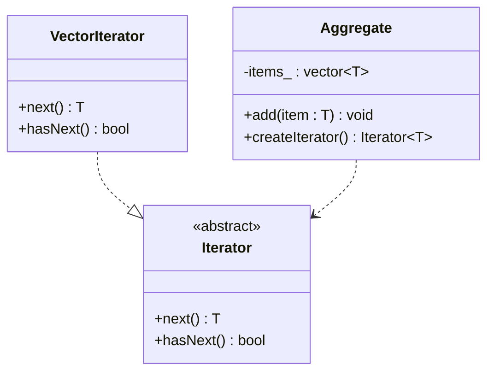

### 迭代器模式

### UML

```mermaid
classDiagram

class Iterator {
    <<abstract>>
    +next() T
    +hasNext() bool
}

class VectorIterator {
    +next() T
    +hasNext() bool
}

VectorIterator ..|> Iterator

class Aggregate {
    -items_ : vector~T~
    +add(item : T) void
    +createIterator() Iterator~T~
}

Aggregate ..> Iterator
```