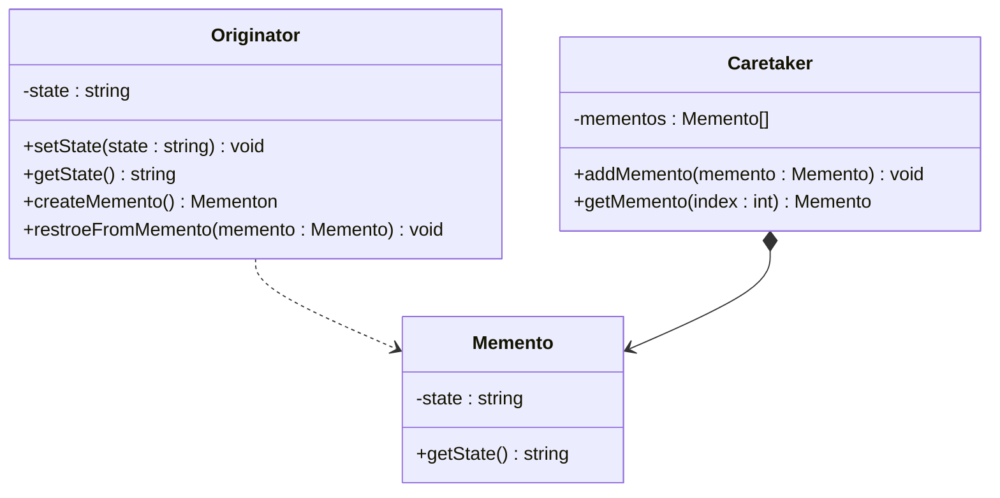

### 备忘录模式

别名快照（snapshot）
允许在不破坏封装的情况下捕获和恢复对象的内部状态

优点：
- 良好的封装性
- 简化了发起人类
- 提供了灵活性

缺点：
- 性能开销
- 不适合保存大量状态

### UML

```mermaid
classDiagram

class Memento {
    -state : string
    +getState() string
}

class Originator {
    -state : string

    +setState(state : string) void
    +getState() string
    +createMemento() Mementon
    +restroeFromMemento(memento : Memento) void
}

Originator ..> Memento

class Caretaker {
    -mementos : Memento[]

    +addMemento(memento : Memento) void
    +getMemento(index : int) Memento
}

Caretaker *--> Memento
```