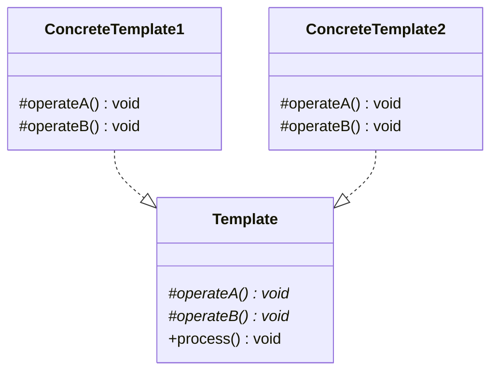

### 模板方法模式

### UML

```mermaid
classDiagram

class Template {
    #operateA() void *
    #operateB() void *
    +process() void
}

class ConcreteTemplate1 {
    #operateA() void
    #operateB() void
}

class ConcreteTemplate2 {
    #operateA() void
    #operateB() void
}

ConcreteTemplate1 ..|> Template
ConcreteTemplate2 ..|> Template
```