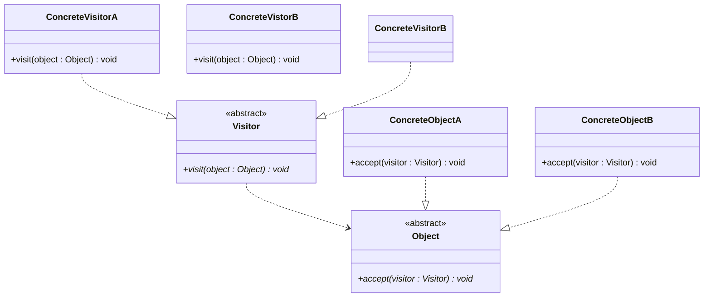

### 访问者模式

允许在不改变被访问元素的类的前提下定义新操作

### UML

```mermaid
classDiagram

class Visitor {
    <<abstract>>
    +visit(object : Object) void *
}

Visitor ..> Object

class ConcreteVisitorA {
    +visit(object : Object) void
}

class ConcreteVistorB {
    +visit(object : Object) void
}

ConcreteVisitorA ..|> Visitor
ConcreteVisitorB ..|> Visitor

class Object {
    <<abstract>>
    +accept(visitor : Visitor) void *
}

class ConcreteObjectA {
    +accept(visitor : Visitor) void
}

class ConcreteObjectB {
    +accept(visitor : Visitor) void
}

ConcreteObjectA ..|> Object
ConcreteObjectB ..|> Object

```