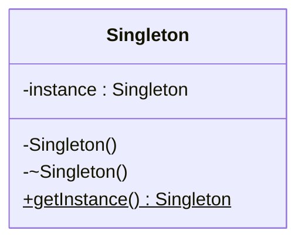

### singleton

#### UML

```mermaid
classDiagram

class Singleton {
    -instance : Singleton

    -Singleton()
    -~Singleton()
    +getInstance() Singleton $
}
```

单例生命周期由单例类承担，不必在客户 `delete` 实例

单例模式为保证实例化的对象只有一份，所以将构造放置 `private` 作用域下，同时删除拷贝构造和复制构造

单例的实例一般在程序的整个生命周期都是需要的，所有将析构放置 `private` 作用域下，避免提前结束生周期

