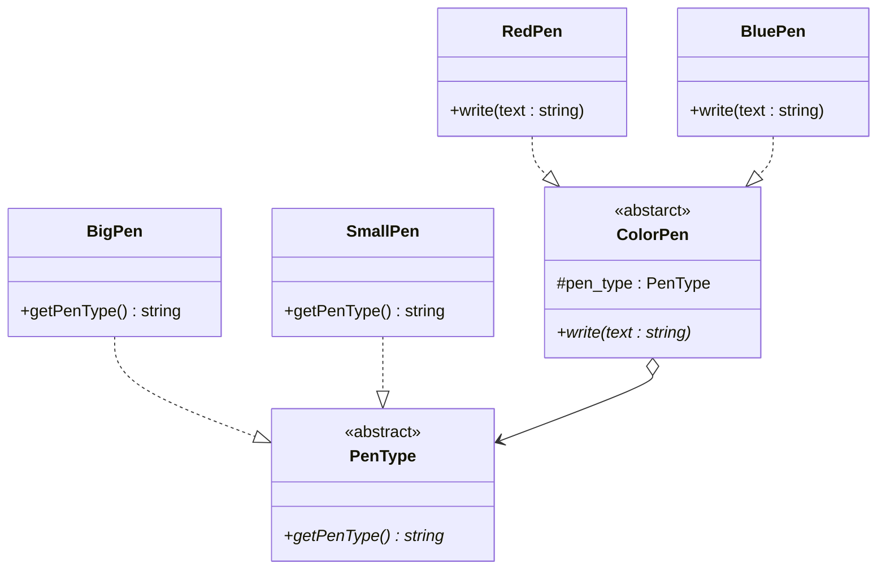

### 桥接模式

用于分离类的功能层次结构和类的实现层次结构

#### UML

```mermaid
classDiagram

class ColorPen {
    <<abstarct>>
    #pen_type : PenType
    +write(text : string) *
}

class RedPen {
    +write(text : string)
}

class BluePen {
    +write(text : string)
}

RedPen ..|> ColorPen
BluePen ..|> ColorPen

class PenType {
    <<abstract>>
    +getPenType() string *
}

class BigPen {
    +getPenType() string
}

class SmallPen {
    +getPenType() string
}

BigPen ..|> PenType
SmallPen ..|> PenType

ColorPen o--> PenType
```