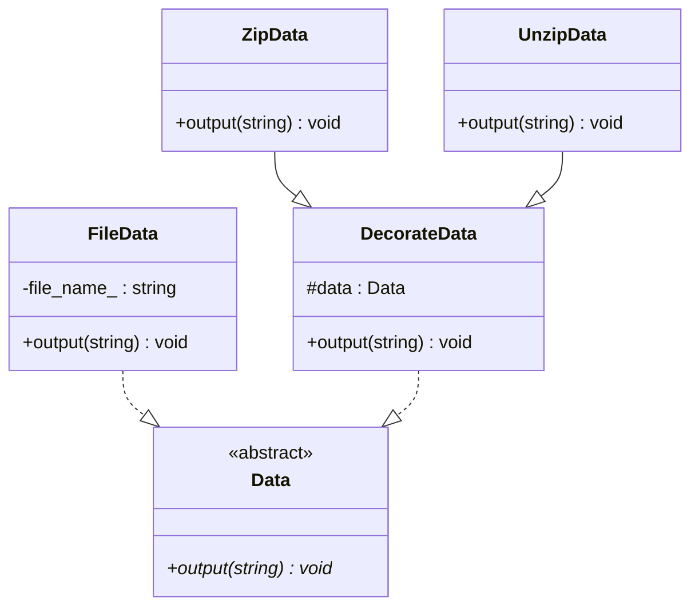

### 装饰模式

也称 warpping

### UML

```mermaid
classDiagram

class Data {
    <<abstract>>
    +output(string) void *
}

class FileData {
    -file_name_ : string
    +output(string) void
}

FileData ..|> Data

class DecorateData {
    #data : Data
    +output(string) void
}

DecorateData ..|> Data

class ZipData {
    +output(string) void
}

class UnzipData {
    +output(string) void
}

ZipData --|> DecorateData
UnzipData --|> DecorateData
```