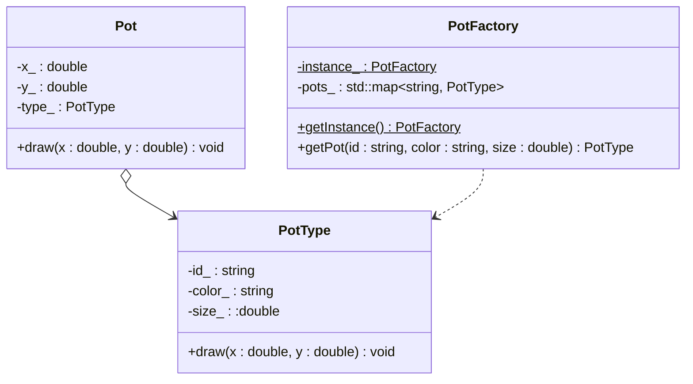

### 享元模式

别名缓存

### UML

```mermaid
classDiagram

class PotType {
    +draw(x : double, y : double) void

    -id_ : string
    -color_ : string
    -size_ : :double
}

class Pot {
    +draw(x : double, y : double) void

    -x_ : double
    -y_ : double
    -type_ : PotType
}

Pot o--> PotType

class PotFactory {
    -instance_ : PotFactory $
    -pots_ : std::map~string, PotType~

    +getInstance() PotFactory $
    +getPot(id : string, color : string, size : double) PotType
}

PotFactory ..> PotType
```