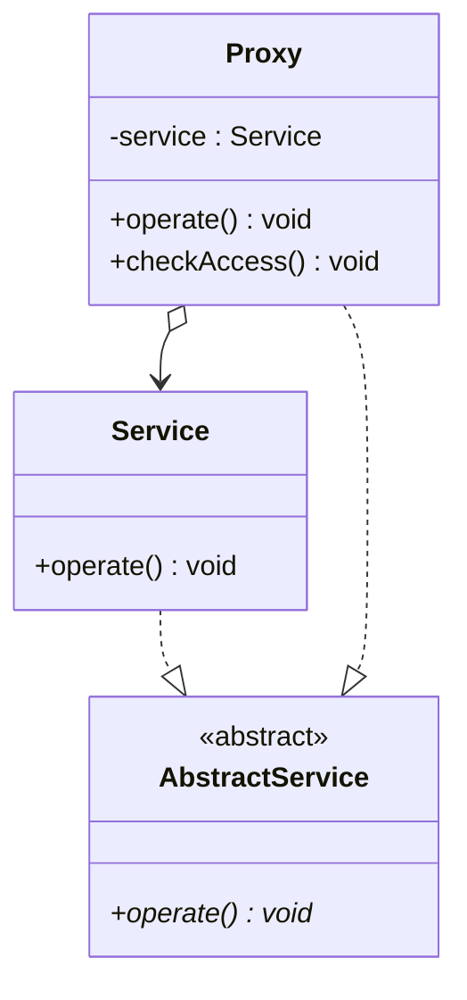

### 代理模式

### UML

```mermaid
classDiagram

class AbstractService {
    <<abstract>>
    +operate() void *
}

class Service {
    +operate() void
}

Service ..|> AbstractService

class Proxy {
    -service : Service

    +operate() void
    +checkAccess() void
}

Proxy ..|> AbstractService
Proxy o--> Service
```