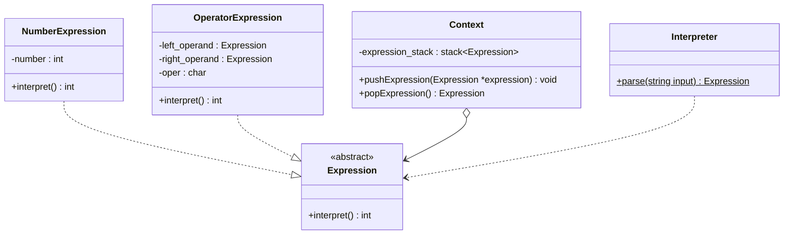

### 解释器模式

定义一种表示语言的语法，并为其提供一种解释器，

### UML

```mermaid
classDiagram

class Expression {
    <<abstract>>
    +interpret() int
}

class NumberExpression {
    -number : int

    +interpret() int
}

NumberExpression ..|> Expression

class OperatorExpression {
    -left_operand : Expression
    -right_operand : Expression
    -oper : char

    +interpret() int
}

OperatorExpression ..|> Expression

class Context {
    -expression_stack : stack~Expression~

    +pushExpression(Expression *expression) void
    +popExpression() Expression
}

Context o--> Expression

class Interpreter {
    +parse(string input) Expression $
}

Interpreter ..> Expression

```