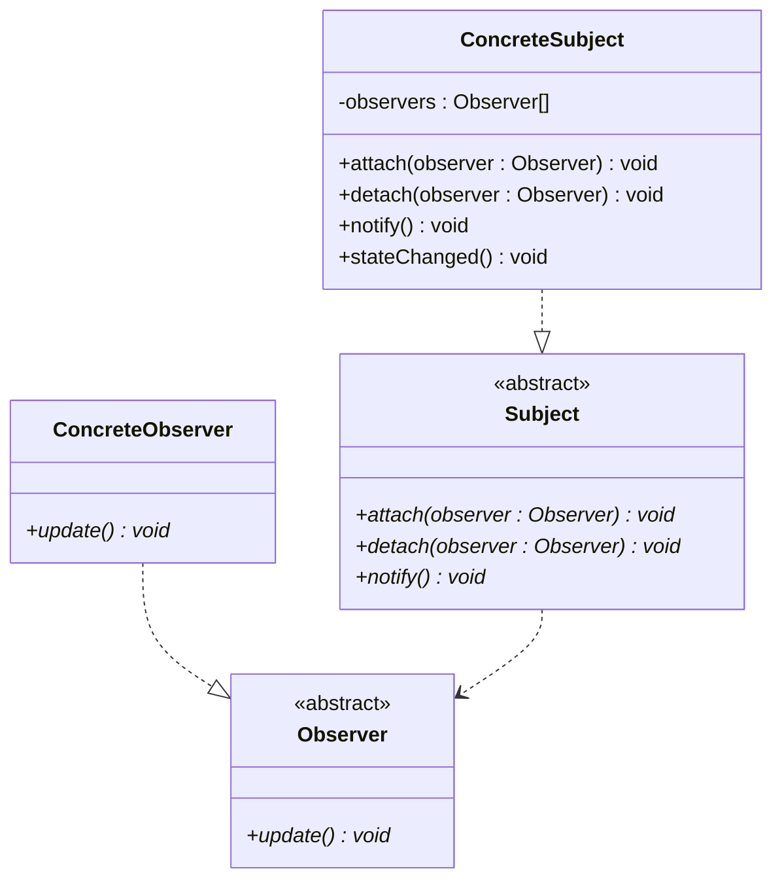

### 观察者模式

别名事件订阅者（event-subscriber）监听者（listener）

用于定义对象之间一对多的关系，当一个对象状态发生变化时，其所有依赖者都会收到通知并自动更新。

优点：
- 开闭原则
- 动态关系，在运行时动态的添加和删除观察者
- 低耦合性，实现观察者和主题之间的关联，减少他们之间的依赖

缺点：
- 更新顺序，不保证通知顺序
- 内存泄漏风险

### UML

