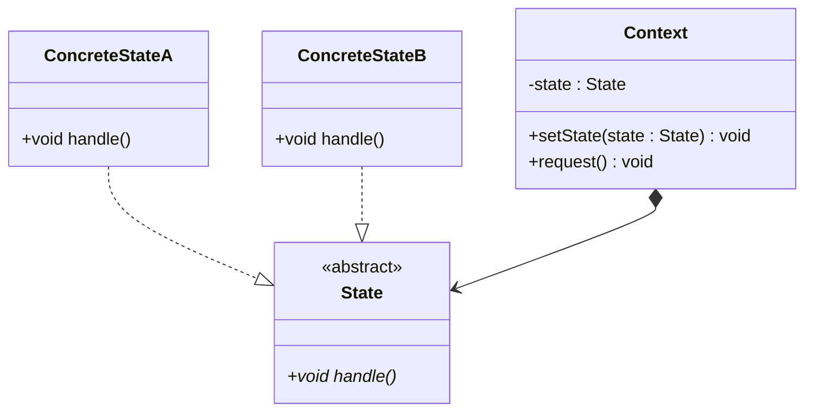

### 状态模式

在对象内部状态改变时改变其行为，使其看上去像改变自身所属的类

### UML

```mermaid
classDiagram

class State {
    <<abstract>>
    +void handle() *
}

class ConcreteStateA {
    +void handle()
}

ConcreteStateA ..|> State

class ConcreteStateB {
    +void handle()
}

ConcreteStateB ..|> State

class Context {
    -state : State

    +setState(state : State) void
    +request() void
}

Context *--> State
```