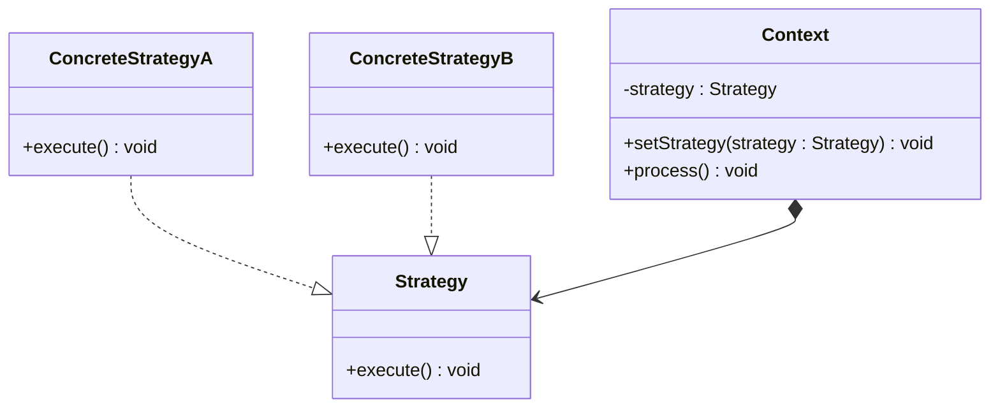

### 策略模式

定义一系列算法，并将这个算法封装，在运行时选择需要的算法，强调的是算法的可互换性和灵活性

### UML

```mermaid
classDiagram

class Strategy {
    +execute() void
}

class ConcreteStrategyA {
    +execute() void
}

ConcreteStrategyA ..|> Strategy

class ConcreteStrategyB {
    +execute() void
}

ConcreteStrategyB ..|> Strategy

class Context {
    -strategy : Strategy
    +setStrategy(strategy : Strategy) void
    +process() void
}

Context *--> Strategy

```