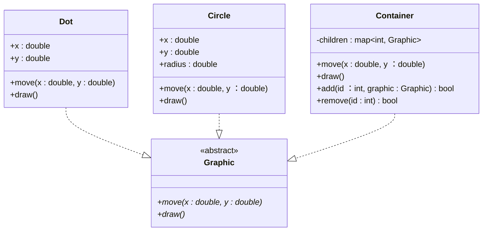

### 组合模式

### UML

```mermaid
classDiagram

class Graphic {
    <<abstract>>
    +move(x : double, y : double) *
    +draw() *
}

class Dot {
    +x : double
    +y : double
    +move(x : double, y : double)
    +draw()
}

class Circle {
    +x : double
    +y : double
    +radius : double
    +move(x : double, y ：double)
    +draw()
}

Dot ..|> Graphic
Circle ..|> Graphic

class Container {
    -children : map~int, Graphic~
    +move(x : double, y ：double)
    +draw()
    +add(id ：int, graphic : Graphic) bool
    +remove(id : int) bool
}

Container ..|> Graphic
```