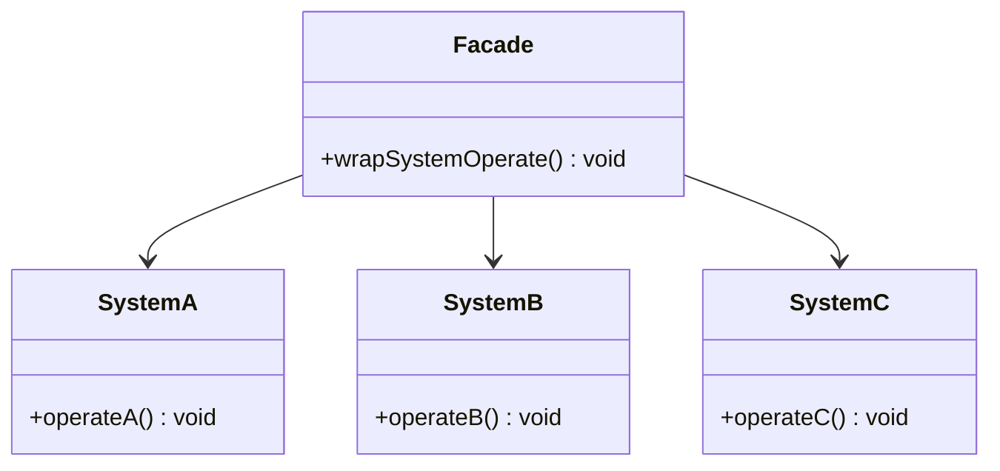

### 外观模式

### UML

```mermaid
classDiagram

class Facade {
    +wrapSystemOperate() void
}

class SystemA {
    +operateA() void
}

class SystemB {
    +operateB() void
}

class SystemC {
    +operateC() void
}

Facade --> SystemA
Facade --> SystemB
Facade --> SystemC
```